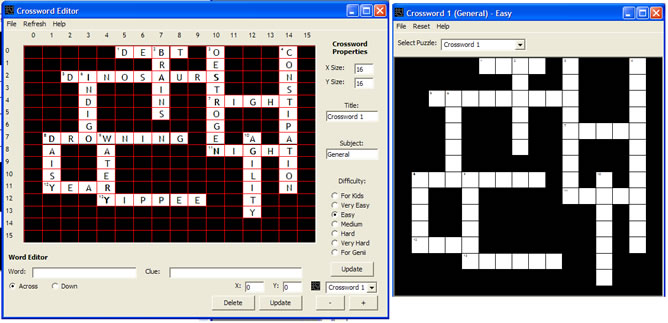



## Crossword Program

### Description

This is a crossword player/editor program. You can create a crossword file with any number of crosswords in it, then play it in the player. Great fun, the kind of thing i make when i'm bored hehe...
 
### More Info
 
You'll need a basic understanding of custom data structures, arrays, type definitions, and enums.

             |
---                |---
**Submitted On**   |2004-03-19 16:51:58
**By**             |[mike payne](https://github.com/Planet-Source-Code/PSCIndex/blob/master/ByAuthor/mike-payne.md)
**Level**          |Intermediate
**User Rating**    |5.0 (10 globes from 2 users)
**Compatibility**  |VB 5\.0, VB 6\.0
**Category**       |[Games](https://github.com/Planet-Source-Code/PSCIndex/blob/master/ByCategory/games__1-38.md)
**World**          |[Visual Basic](https://github.com/Planet-Source-Code/PSCIndex/blob/master/ByWorld/visual-basic.md)
**Archive File**   |[Crossword\_1722223202004\.zip](https://github.com/Planet-Source-Code/mike-payne-crossword-program__1-52500/archive/master.zip)

